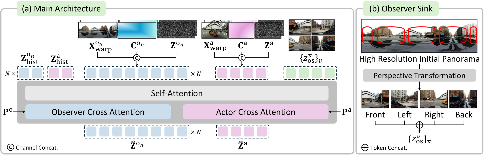

<div align="center">
  <h1>World Observer: Joint Actor-Observer Generation for Persistent World Modeling</h1>
</div>

<div align="center">
  <a href="https://eenrue.github.io/">Hyunwook Choi</a><sup>1</sup>,
  <a href="https://dhyun22.github.io/">Dahyun Chung</a><sup>1</sup>,
  <a href="https://scholar.google.com/citations?hl=ko&amp;user=8wSdx3UAAAAJ">Hyunsung Kim</a><sup>1</sup>,
  <a href="https://jinsy515.github.io/my-page/">Siyoon Jin</a><sup>1</sup><br>
  <a href="https://wlsguur.github.io/">Jinhyeok Choi</a><sup>1</sup>,
  <a href="https://j0seo.github.io/">Junyoung Seo</a><sup>1</sup>,
  <a href="https://cvlab.kaist.ac.kr">Seungryong Kim</a><sup>1</sup><br><br>
  <sup>1</sup>KAIST AI
</div>

<br>
<br>

<p align="center">
  <a href="https://cvlab-kaist.github.io/world-observer/" target="_blank" rel="noopener noreferrer" style="display: inline-block;"></a>&nbsp;
  <!-- <a href="https://arxiv.org/abs/xxxx.xxxxx" target="_blank" rel="noopener noreferrer" style="display: inline-block;"></a>&nbsp; -->
</p>

<br>

## Abstract

How can a world model continuously observe regions beyond the actor’s current view? Video world models simulate how an environment evolves from an agent’s actions, yet remain actor-centric. Once an object leaves the actor’s view, they lose direct evidence of its evolution, often failing to preserve its state and dynamics upon re-entry. To address this, we introduce **World Observer**, which decouples observing from acting by jointly generating a perspective *actor* for the agent-centric view with one or more panoramic *observers* that watch selected world regions. This allows objects that leave the actor’s view to remain visually evolving in an observer, so their updated states are reflected when they re-enter. We ground the actor and observers by warping from a shared panoramic source for explicit geometric correspondence, and introduce an *Observer Sink* of high-resolution perspective references to restore fine appearance upon re-entry. Since the observers are decoupled from the actor, they can be placed freely across the scene, extended to multiple locations for broader coverage, and driven by control signals to steer out-of-view evolution. To evaluate out-of-view evolution, we further introduce world-space metrics and a benchmark spanning real and synthetic scenes. World Observer substantially improves out-of-view dynamics while remaining competitive in visual fidelity, camera control, and 3D adherence.

<div align="center">
  
</div>

## Release Plan

We are currently undergoing internal review and code cleanup, and plan to release the following soon:

- [ ] World Observer training dataset
- [ ] Model checkpoint and inference code
- [ ] Training code

## Citation

```bibtex
@article{choi2026worldobserver,
  title={{World Observer: Joint Actor-Observer Generation for Persistent World Modeling}},
  author={Choi, Hyunwook and Chung, Dahyun and Kim, Hyunsung and Jin, Siyoon and Choi, Jinhyeok and Seo, Junyoung and Kim, Seungryong},
  journal={arXiv preprint},
  year={2026}
}
```
